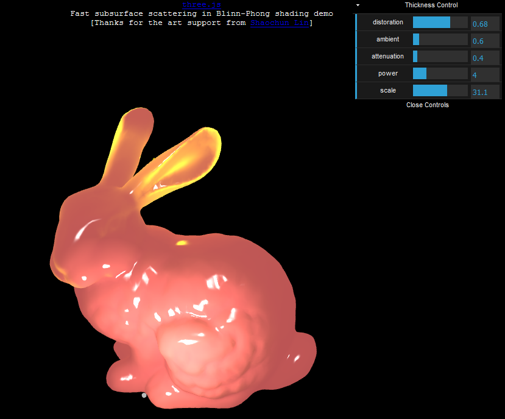

# Collaboration Work

## Pipeline: Surface Scattering

### **Created the translucency map and the GUI panel for Three.js**

* The thickness map is generated using Substance Painter. Used to create it using Arnold's AO with reversed normal option checked in Maya 2017, but the generated map doesn't look quite right. SP gives a better result since it offers more params, and generates the map based on reversed normals. Invert it should give the desired result.

